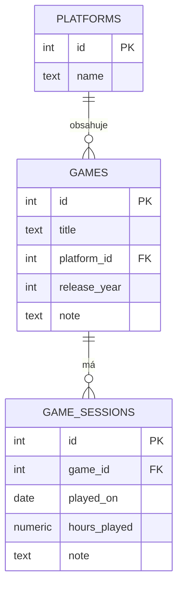

# Game Tracker

Desktopová aplikace pro sledování her a herních relací. Napsaná v **Avalonia (.NET 8)**, databáze **PostgreSQL v Dockeru**, migrace přes **DbUp**.

## Funkce

- Přidávání, úprava a mazání her
- Sledování herních relací (datum, hodiny, poznámka)
- Vyhledávání a řazení her
- Statistiky — celkové hodiny, nejhranější hra
- Automatické DB migrace při startu (DbUp)

## ER Diagram



## Technologie

| Vrstva | Technologie |
|---|---|
| UI | Avalonia 11 + MVVM |
| Databáze | PostgreSQL 16 v Dockeru |
| ORM | Dapper |
| Migrace | DbUp |
| DI | Microsoft.Extensions.DependencyInjection |

## Požadavky

- [.NET 8 SDK](https://dotnet.microsoft.com/download)
- [Docker Desktop](https://www.docker.com/products/docker-desktop/)

## Spuštění

### 1. Klonuj repozitář

```bash
git clone <url-repozitare>
cd formular0
```

### 2. Vytvoř `.env` soubor

```bash
cp formular0/.env.example formular0/.env
```

Uprav hodnoty v `.env` podle svého prostředí.

### 3. Spusť databázi

```bash
docker compose up -d
```

Databáze naběhne prázdná — tabulky a seed data vytvoří aplikace sama při prvním spuštění pomocí **DbUp**.

### 4. Spusť aplikaci

```bash
cd formular0
dotnet run
```

Při spuštění aplikace:
1. Načte `.env` soubor
2. **Spustí DbUp migrace** — vytvoří tabulky a naplní číselník platforem
3. Otevře okno aplikace

## Struktura projektu

```
formular0/
├── Models/             # Game, GameSession, Platform
├── Repositories/       # Interface + implementace (Dapper + Npgsql)
├── ViewModels/         # MVVM ViewModels, RelayCommand, navigace
├── Views/              # Avalonia AXAML views (3 views)
├── Scripts/            # DbUp migrační SQL skripty
│   ├── 0001_CreatePlatforms.sql
│   ├── 0002_CreateGames.sql
│   ├── 0003_CreateGameSessions.sql
│   └── 0004_SeedPlatforms.sql
├── Services.cs         # Dependency Injection + connection string
├── Program.cs          # Entry point + DbUp runner
├── .env.example        # Ukázkové env proměnné
docker-compose.yaml     # PostgreSQL 16 + volume
schema.sql              # Referenční schéma (pro dokumentaci)
seed.sql                # Referenční seed (pro dokumentaci)
README.md
```

## Navigace v aplikaci

| View | Popis |
|---|---|
| **Seznam her** | Přehled her, vyhledávání, řazení, statistiky |
| **Detail hry** | Info o hře, celkové hodiny, CRUD herních relací |
| **Formulář hry** | Vytvoření / úprava hry, výběr platformy (ComboBox) |

## Databázové migrace (DbUp)

Migrace jsou SQL skripty ve složce `Scripts/` zabudované do sestavení jako embedded resources.
DbUp při každém spuštění aplikace zkontroluje tabulku `schemaversions` a spustí pouze nové skripty.

Pro přidání nové migrace stačí vytvořit soubor `Scripts/XXXX_Popis.sql` — aplikace ji spustí automaticky při příštím startu.
